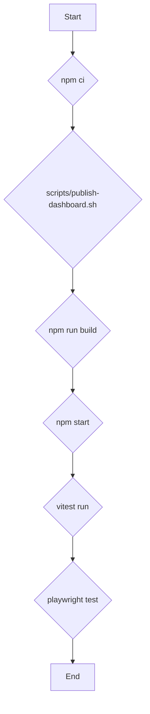

# Justice Dashboard

This is a [Next.js](https://nextjs.org) project bootstrapped with [`create-next-app`](https://nextjs.org/docs/app/api-reference/cli/create-next-app).


## Hardening Gate (CI)

If a PR is labeled hardening, CI will:

1. Post a progress comment showing the Hardening TODO checklist status.
2. Block leaving Draft unless all items under the section heading `## Hardening TODO` in the PR description are checked.

Keep the checklist in the PR description (not comments) so automation can read it.

## Contributing: PR templates & hardening

We ship two PR templates:

- **Default PR template** – auto-applied to every PR.
- **Hardening PR** – selectable for security/performance changes. See the template: [.github/PULL_REQUEST_TEMPLATE/hardening.md](.github/PULL_REQUEST_TEMPLATE/hardening.md)

How to use the Hardening template: on the “Open a pull request” page, click Choose a template → Hardening PR.
Enforcement: when a PR has the hardening label and leaves Draft, CI enforces the checklist under `## Hardening TODO`. Use the security label as an additional signal for reviewers.

## Getting Started

First, run the development server:

```bash
npm run dev
# or
yarn dev
# or
pnpm dev
# or
bun dev
```

Open [http://localhost:3000](http://localhost:3000) with your browser to see the result.

You can start editing the page by modifying `app/page.tsx`. The page auto-updates as you edit the file.

This project uses [`next/font`](https://nextjs.org/docs/app/building-your-application/optimizing/fonts) to automatically optimize and load [Geist](https://vercel.com/font), a new font family for Vercel.

## Learn More

To learn more about Next.js, take a look at the following resources:

- [Next.js Documentation](https://nextjs.org/docs) - learn about Next.js features and API.
- [Learn Next.js](https://nextjs.org/learn) - an interactive Next.js tutorial.

You can check out [the Next.js GitHub repository](https://github.com/vercel/next.js) - your feedback and contributions are welcome!

## Deploy on Vercel

The easiest way to deploy your Next.js app is to use the [Vercel Platform](https://vercel.com/new?utm_medium=default-template&filter=next.js&utm_source=create-next-app&utm_campaign=.create-next-app-readme) from the creators of Next.js.

Check out our [Next.js deployment documentation](https://nextjs.org/docs/app/building-your-application/deploying) for more details.

## Deployment (Vercel)

We intentionally keep platform config minimal:

- `vercel.json` defines only `functions` memory/maxDuration (no rewrites/redirects/routes mix).
- `next.config.mjs` adds security headers (CSP commented until audited) and long-term cache headers for `/dashboard/assets/*` built by Vite.
- No legacy `now.json` / `.now*` artifacts are present.

### Re‑linking the project if local state is stale

Sometimes a cloned repo has a `.vercel` folder pointing at the wrong project or team which can surface “mixed routing” style warnings even when configs are clean.

Windows (PowerShell):

```powershell
Remove-Item -Recurse -Force .vercel -ErrorAction SilentlyContinue
vercel logout
vercel login
vercel link
vercel
```

macOS / Linux:

```bash
rm -rf .vercel || true
vercel logout
vercel login
vercel link
vercel
```

### Adding routing changes safely

If you later add rewrites/redirects/headers/trailingSlash, do NOT also add a top-level `routes` array in `vercel.json`—pick the granular keys only. Avoid setting `basePath` unless you relocate the entire app.

### Adjusting function limits

To change memory/duration defaults, edit `vercel.json`:

```jsonc
{
  "$schema": "https://openapi.vercel.sh/vercel.json",
  "functions": {
    "api/**": { "memory": 512, "maxDuration": 30 },
    "app/**/route.ts": { "memory": 512, "maxDuration": 30 },
  },
}
```

See `README_DEPLOY.md` for full deployment notes.

## Testing

This project uses Playwright for E2E tests and Vitest for unit tests.

### Local Testing

1.  **Build and start the app:**

    ```bash
    npm run build
    npm start
    ```

2.  **Run tests in a separate terminal:**

    ```bash
    # Run Vitest unit tests
    npm run test:unit

    # Run Playwright E2E tests
    npm run e2e
    ```

### CI Flow

The CI pipeline is defined in `.github/workflows/test.yml` and runs on every pull request and push to `main`.


