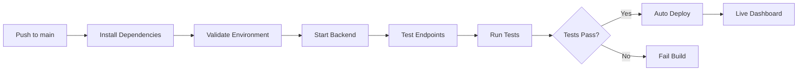

# 🚀 Justice Dashboard - Auto-Deploy Setup Guide

## ✅ CI/CD Pipeline Overview

Your CI/CD pipeline now has two stages:

1. **Build & Test** - Runs on every push/PR
2. **Deploy** - Runs only on successful main branch pushes

## 🔧 Auto-Deploy Setup Options

### Option A: Render (Recommended)

1. **Create Render Account**: Go to [render.com](https://render.com)
2. **Connect GitHub**: Link your justice-dashboard repository
3. **Create Web Service**:
   - Build Command: `npm run setup && npm run build`
   - Start Command: `npm start`
   - Environment: Add your production environment variables
4. **Get Deploy Hook**:
   - Go to Settings → Deploy Hook
   - Copy the webhook URL
5. **Add to GitHub Secrets**:
   - Go to repository Settings → Secrets and Variables → Actions
   - Add secret: `RENDER_DEPLOY_HOOK` = your webhook URL

### Option B: Vercel

```bash
# Install Vercel CLI
npm i -g vercel

# Login and link project
vercel login
vercel link

# Add to GitHub Secrets: VERCEL_TOKEN
```

### Option C: Netlify

```bash
# Install Netlify CLI  
npm i -g netlify-cli

# Login and link
netlify login
netlify link

# Add to GitHub Secrets: NETLIFY_AUTH_TOKEN, NETLIFY_SITE_ID
```

## 🔑 Production Environment Variables

Set these in your hosting platform:

```env
NODE_ENV=production
JWT_SECRET=your-super-secure-32-char-production-secret
SESSION_SECRET=your-super-secure-32-char-session-secret
ADMIN_USERNAME=admin
ADMIN_PASSWORD=your-secure-admin-password
OPENAI_API_KEY=sk-your-real-openai-key
PORT=3000
```

## 📊 CI/CD Workflow Stages



## 🎯 What Happens After Setup

Every time you push to main:

1. ✅ CI runs automatically
2. ✅ If all tests pass
3. 🚀 Auto-deploys to your live URL
4. 📧 You get notified of success/failure

## 🛠️ Manual Deploy (Backup)

If auto-deploy fails, you can manually deploy:

```bash
# Render
curl -X POST "your-render-deploy-hook-url"

# Vercel  
vercel --prod

# Netlify
netlify deploy --prod
```

## 🔍 Troubleshooting

### Deploy Hook Not Triggering
- Check GitHub Secrets are set correctly
- Verify webhook URL is valid
- Check GitHub Actions logs

### Build Failing in Production
- Ensure all environment variables are set
- Check production dependencies are installed
- Verify start command is correct

---

## 🎉 Success Indicators

When everything is working:

- ✅ Green CI build on every push
- ✅ Auto-deploy triggers on main branch
- ✅ Live dashboard updates automatically
- ✅ No manual deployment needed

**Choose your hosting platform and I'll help you set it up!** 🚀
