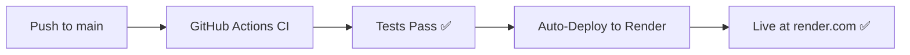

# 🚀 Render Auto-Deploy Setup Complete!

## ✅ **Your Deploy Hook:** 
```
https://api.render.com/deploy/srv-d1o4fo7diees739g6de0?key=tMdeYjDLj7g
```

## 📋 **Setup Instructions:**

### **Step 1: Add GitHub Secret**
1. Go to: `https://github.com/sspedowski/justice-dashboard/settings/secrets/actions`
2. Click **"New repository secret"**
3. Enter:
   - **Name**: `RENDER_DEPLOY_HOOK`
   - **Secret**: `https://api.render.com/deploy/srv-d1o4fo7diees739g6de0?key=tMdeYjDLj7g`
4. Click **"Add secret"**

### **Step 2: Test Auto-Deploy**
Once the secret is added:
1. Make any small change to your code
2. Push to the `main` branch
3. Watch GitHub Actions run
4. See automatic Render deployment trigger

## 🎯 **What Happens Next:**



## 🔍 **Monitoring Your Deployments:**

### **GitHub Actions:**
- View at: `https://github.com/sspedowski/justice-dashboard/actions`
- Look for green checkmarks ✅

### **Render Dashboard:**
- View at: `https://dashboard.render.com`
- Monitor deployment logs and status

## 🌐 **Your Live URLs:**

Once deployed, your Justice Dashboard will be available at:
- **Your Render URL**: `https://justice-dashboard-xxxx.onrender.com` (check Render dashboard)
- **Health Check**: `https://your-app.onrender.com/api/health`
- **Dashboard**: `https://your-app.onrender.com`

## 🔧 **Manual Deploy (If Needed):**

You can also trigger deployments manually:
```bash
# PowerShell
Invoke-RestMethod -Uri "https://api.render.com/deploy/srv-d1o4fo7diees739g6de0?key=tMdeYjDLj7g" -Method POST

# Or using curl (Git Bash/WSL)
curl -X POST "https://api.render.com/deploy/srv-d1o4fo7diees739g6de0?key=tMdeYjDLj7g"
```

## 🎉 **Success Indicators:**

✅ **GitHub Secret Added** → Auto-deploy enabled  
✅ **CI Pipeline Green** → All tests passing  
✅ **Render Deployment** → Live dashboard  
✅ **Health Check** → API endpoints working  

## 📝 **Next Push Checklist:**

1. ✅ Add the GitHub secret (RENDER_DEPLOY_HOOK)
2. ✅ Make a small code change
3. ✅ Push to main branch
4. ✅ Watch GitHub Actions
5. ✅ See Render auto-deploy
6. ✅ Visit your live Justice Dashboard!

---

## 🚀 **You're Ready to Go Live!**

Your Justice Dashboard now has:
- ✅ **Automatic CI/CD** 
- ✅ **Auto-deployment**
- ✅ **Production monitoring**
- ✅ **Live URL**

**Add that GitHub secret and push - your dashboard will be live in minutes!** 🌟
